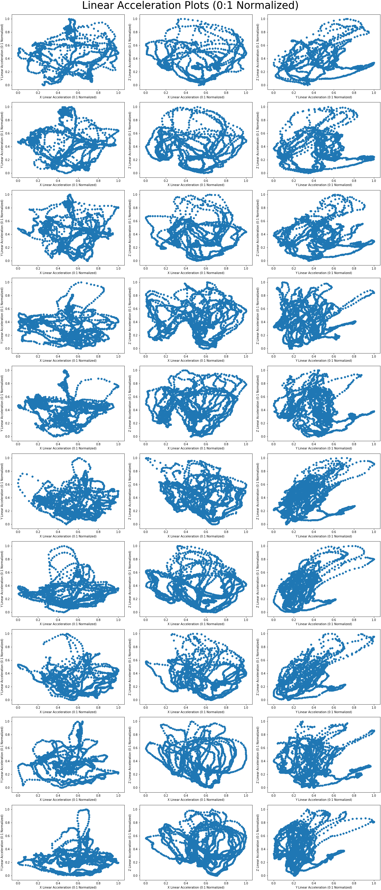

# Gesture Recognition (GR)

## Abstract

This repo documents the development of a
motion prediction algorithm based on a set of
purpose-built hidden Markov models (HMM).
The models receive motion data (linear and
angular accelerations) collected from the inertial
measurement unit (IMU) in a mobile device[1].
Using this data, the HMMs are trained to make
predictions about the type of motion being
performed.

Using motion data and corresponding types of
motion [2], —referred to as gestures, i.e.: circle,
infinity, etc.— the algorithm trains a set of HMMs
to classify similar motions not present in the
training set as gestures of a particular type.

## Normalization Results

